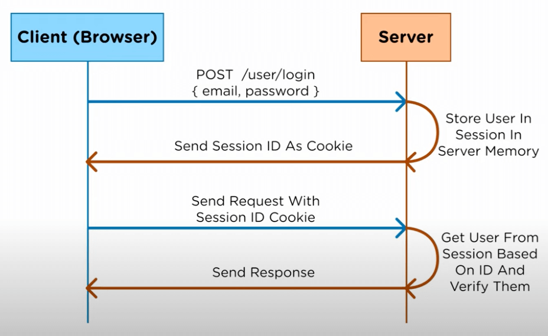
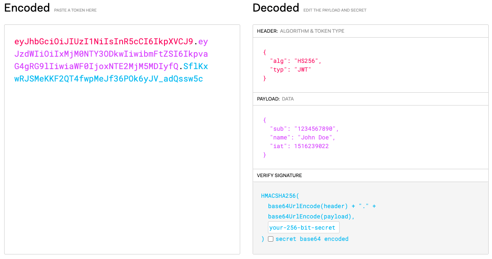

> This is my first blog post dedicated to researching and breaking down a technical concept that I'd heard about but had no idea what it was.

## What is it?

**JSON Web Tokens (JWT)** are commonly used for **authorisation** (managing what users can see or do) to verify that a user is who they say they are. For example, it may be used to check if a user is logged in or not if they are trying to view a webpage that only logged in users should be able to see.

---

## The problem

To understand the benefits of JWT, it is helpful to first understand the traditional, alternative approach using **sessions**.

With sessions, a client (or user) who logs in successfully is assigned a session ID that is stored by the server in memory. Any time the client sends a request to the server that requires authorisation, the server check in memory whether or not the client's session ID is valid (i.e. they are who they claim they are).

This is also called a 'stateful' approach, because the server is always keeping track of the state/session of all users.

The main issue with this is scalability. Session IDs need to be stored on the server and looked up on each request made by the client. This leads to performance bottlenecks as many users may need to make requests at any time.

---

## The solution

Using JWTs is different from sessions because nothing is stored on the server. Therefore, it is called a 'stateless approach'. JWTs are stored by the client (e.g. the user's browser).

A JWT comprises three components:

-   **Header**: Determines the hashing algorithm used in the 'Verify Signature' section. This corresponds to the red section of the encoded JWT in the image.
-   **Payload**: The information stored within the token. This corresponds to the purple section of the encoded JWT in the image. Useful pieces of information that may be included are:
    -   **sub**: The ID of the user.
    -   **name**: The username of the user.
    -   **iat**: The time that the JWT was _issued at_ (e.g. in Unix time).
    -   **exp**: The time the token expires. This should be a short time period (which could be as short as 5 minutes) to ensure that a token isn't valid forever for a potential attacker to exploit. If you want a user to stay logged in for longer than the expiry time so they don't have to keep re-logging in, you will need to use **refresh tokens** (a special kind of token used by the client to obtain a renewed access token).
-   **Verify Signature**: This is the encoded hash result which will be used to verify that a JWT is valid for authorisation. This corresponds to the cyan section of the encoded JWT in the image.

The **encoding** process in the 'verify signature' section is as follows:

1. The header and payload are encoded using a scheme called **Base64**. Note that this encoding scheme is not secure, and so nothing sensitive should be included.
2. The header and payload are then combined.
3. The combined value is hashed using the algorithm stated in the 'header' section, with the help of a pre-determined **secret key** stored in the server.

When the client sends a request to the server with a JWT, the server will verify the client's identity by **decoding** the received JWT:

1. The header and payload are encoded using a scheme called _Base64_.
2. The header and payload are then combined.
3. The combined value is hashed using the algorithm stated in the 'header' section, with the help of a pre-determined secret key stored in the server.
4. The server then checks whether the hash result calculated based on the header and payload data is the same as the hash provided in the last section of the JWT. If it is the same, then the user is who they say they are. If they are not the same, then it may indicate that the payload data provided was not valid.

---

## Further issues to consider when implementing JWT

-   The implementation of a silent refresh workflow to keep refreshing the JWT of a logged-in user in the background.
-   The possible need of invalidating refresh tokens when a user logs out so it cannot be used by an attacker to request a valid JWT.
-   Not storing anything in local storage or cookies if possible since these can be easily intercepted by an attacker.
-   Handling users logging out by deleting the client-side JWT so it cannot be further used to make requests.
-   Handling the scenario where a user is logged in on multiple tabs, such that logging out on one tab should log them out on every tab.

---

## References & image sources

-   _What is JWT and Why Should You Use JWT_. https://www.youtube.com/watch?v=7Q17ubqLfaM
-   _jwt.io_. https://jwt.io/
-   _The Ultimate Guide to handling JWTs on frontend clients (GraphQL)_. https://hasura.io/blog/best-practices-of-using-jwt-with-graphql
-   _How to Invalidate JSON Web Tokens_. https://blog.indrek.io/articles/invalidate-jwt/
