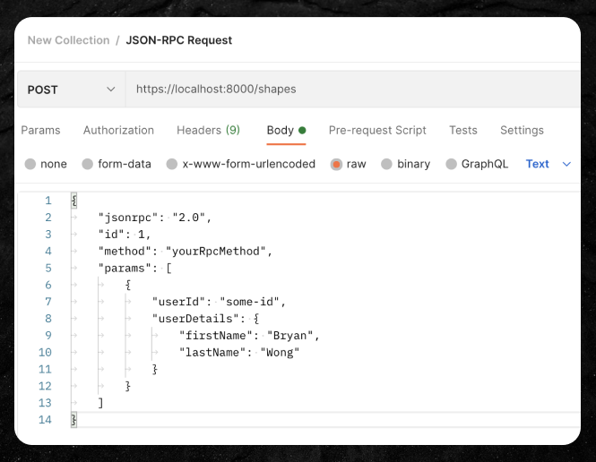

## 😵‍💫 What is it?

JSON-RPC is a remote procedure call protocol used to make a request in JSON format to invoke a method in a server/service.

When building a Spring application, Jackson provides multiple ways of deserialising your JSON request into Java/Kotlin objects.

## 🧐 How to make a basic JSON-RPC call on Postman

1. Change the request type to `POST`.
2. Enter the URL to make a request to.
3. Click on the 'Body' tab and select 'raw'. This is where we will write our request body.



We can typically keep the first two key-values the same:

-   `jsonrpc`: Indicates the JSON-RPC specification type.

-   `id`: Only matters if you are using JSON-RPC in the context of asynchronous or batch calls (e.g. multiple JSON-RPC calls in a single request) which then allows you to map the responses back to your requests. We don't need this in this context where we are making a single JSON-RPC call with a single HTTP request.

We can modify the next two as we need them:

-   `method`: The method/function name we are invoking.

-   `params`: The list of parameters to pass in the request.

### Parameter format

Our parameters can either be in a _positional_ or _named_ format.

Named means that you can provide the method parameters in any order but the use of key-value pairs allows us to map each key to a particular parameter. They need to be wrapped in curly braces `{}`.

```json
{
	"jsonrpc": "2.0",
	"id": 1,
	"method": "yourRpcMethod",
	"params": [
		{
			"userId": "some-id",
			"userDetails": {
				"firstName": "Bryan",
				"lastName": "Wong"
			}
		}
	]
}
```

Positional means that you do not have to specify any keys but the parameters in your request must be in the same order as the arguments are specified in. They need to be wrapped in square brackets `[]`.

```json
{
	"jsonrpc": "2.0",
	"id": 1,
	"method": "yourRpcMethod",
	"params": [
		"some-id",
		{
			"firstName": "Bryan",
			"lastName": "Wong"
		}
	]
}
```

## How to make a JSON RPC call with a polymorphic-type parameter

Here are two approaches on how to explicitly specify a type of a parameter which could be of multiple subtypes/subclasses.

### Using the @c annotation

By default, we can use the `@c` annotation which is where Jackson uses the minimal path of the class name as the type identifier (`JsonTypeInfo.Id.MINIMAL_CLASS`).

For example, say our request required a parameter of type `Shape` that had sub-types of `Square` and `Rectangle` such as in this Kotlin code:

```kotlin
sealed class Shape {
    data class Square(val lengthInCentimetres: Int)
    data class Rectangle(val lengthInCentimetres: Int, val widthInCentimetres: Int)
}
```

If we wanted to make a JSON-RPC request that passed in a parameter of type `Square`, we can specify the sub-type like so:

```json

{
    "jsonrpc": "2.0"
    "id":1,
    "method": "someMethod",
    "params": [
        {
            "@c": ".Shape$Square",
            "lengthInCentimetres": "10"
        }
    ]
}

```

### Using a Jackson-specified type property

We can use the annotations `@JsonTypeInfo` to specify an explicit `type` property and `@JsonSubTypes` to define how we want to refer to sub-types.

For example, we can add this Jackson configuration to our `Shape` class:

```kotlin
@JsonTypeInfo(use = JsonTypeInfo.Id.NAME, include = JsonTypeInfo.As.PROPERTY, property = "type")
@JsonSubTypes(
    JsonSubTypes.Type(value = Square::class, name = "SQUARE"),
    JsonSubTypes.Type(value = Rectangle::class, name = "RECTANGLE"),
)
sealed class Shape {
    data class Square(val lengthInCentimetres: Int)
    data class Rectangle(val lengthInCentimetres: Int, val widthInCentimetres: Int)
}

```

`JsonTypeInfo.Id.NAME` indicates that we want to use the name of the class to infer the actual class type.

`JsonTypeInfo.As.PROPERTY` indicates that we want to specify an explicit property alongside our other parameters in which we will include our type information. `property` indicates the name of that property. In this case, our field is just called `type`.

To make the same JSON-RPC request to pass in a parameter of type `Square` we can do it like this:

```json

{
    "jsonrpc": "2.0"
    "id":1,
    "method":"someMethod",
    "params": [
        {
            "type": "SQUARE",
            "lengthInCentimetres": "10"
        }
    ]
}

```
